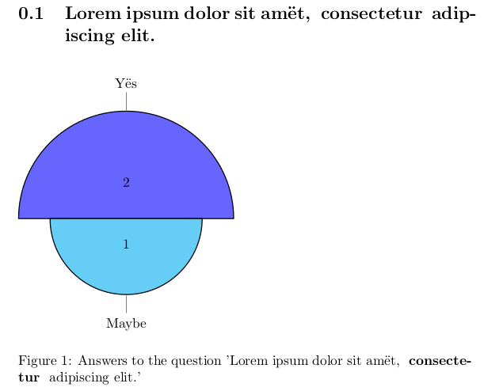
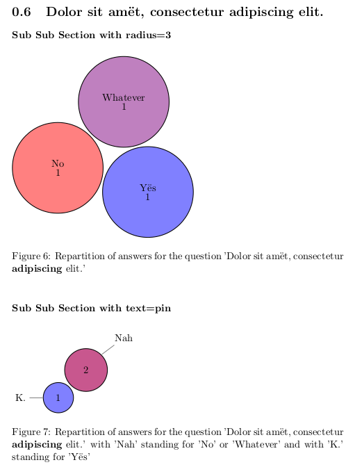

# Django survey

This is a django survey app, its based on and compatible with "django-survey".
This means you will be able to migrate from an ancient version of django-survey.
As the old 'django-survey' seem to be inactive and do not accept pull-request,
this is **available on PyPi as "django-survey-and-report".**

Compared to django-survey, it has been refactored, ported to python 3, and test
has been added as well as exports as csv and pdf for the survey's results.

## Getting started

In order to get started, install the requirements, create the database, create
a superuser, launch the server, then create your survey in the django admin :

~~~~
  pip install -r requirements.txt
  python manage.py migrate
  python manage.py createsuperuser
  python manage.py runserver
  # Create survey in interface
~~~~

You will have to change the settings in order to suit your need.

If you want to use the Sankey's diagram you will have to install python-tk
(for python 2.7) or python3-tk (for python 3.x).

### Creating a survey

Using the admin interface you can create surveys, add questions, give questions
categories, and mark them as required or not. You can define choices for answers
using comma separated words.

The front-end survey view then automatically populates based on the questions
that have been defined and published in the admin interface. We use bootstrap3
to render them.

### Handling the results

Submitted responses can be viewed via the admin backend, in an exported csv
or in a pdf generated with latex. The way the pdf is generated is
configurable in a yaml file, globally, survey by survey, or question by
question. In order to render pdf you will need to install texlive and python-tk
or python3-tk for sankey's diagram.

This is an example of a configuration file

#### Basic example

~~~~
generic:
    document_option: 11pt

Test survëy:
    document_class: report
    questions:
  Lorem ipsum dolor sit amët, <strong> consectetur </strong> adipiscing elit.:
      chart:
          type: polar
          text: pin
  Dolor sit amët, consectetur<strong>  adipiscing</strong>  elit.:
      chart:
          type: cloud
          text: inside
~~~~

The pdf is then generated using the very good pgf-pie library.

#### Sankey diagram

If you installed python-tk (for python 2.7) or python3-tk (for python 3.x), you
can also show the relation between two questions using a sankey diagram :

~~~~
Lorem ipsum dolor sit amët, <strong> consectetur </strong> adipiscing elit.:
    chart:
      type: sankey
      question: Dolor sit amët, consectetur<strong>  adipiscing</strong>  elit.
~~~~

You get this as a result:

#### Advanced example

You can also limit the answers shown by cardinality, filter them, group them
together and choose the color for each answer or group of answers.

If you use this configuration for the previous question:
~~~~
Test survëy:
  Dolor sit amët, consectetur<strong>  adipiscing</strong>  elit.:
    multiple_charts:
      Sub Sub Section with radius=3 :
        color: {"Yës": "blue!50", "No": "red!50",
                "Whatever": "red!50!blue!50"}
        radius: 3
      Sub Sub Section with text=pin :
        group_together: {"Nah": ["No", "Whatever"], "K.": ["Yës"]}
        color: {"Nah": "blue!33!red!66", "K.": "blue!50"}
        text: pin
    chart:
      radius: 1
      type: cloud
      text: inside
~~~~

You get this as a result:

For a full example of a configuration file look at `example_conf.yaml`, you can
also generate your configuration file with the `generate_tex_configuration`
command, it will create the default skeleton for every survey and question.

## Getting started as a contributor

You may want to use a virtualenv for python 2.7 or 3+ :

~~~~
  python3.5 -m venv .3env/
  # Resp. for python 2.7 : virtualenv .env
  source .3env/bin/activate
  # Resp. for python 2.7 : source .env/bin/activate
~~~~

In order to get started, install the dev requirements, create the database,
create a superuser, load the test dump, then launch the server :

~~~~
  pip install -r requirements_dev.txt
  python manage.py migrate
  python manage.py createsuperuser
  python manage.py loaddata survey/tests/testdump.json
  python manage.py runserver
~~~~

### Test :

~~~~
  python manage.py test survey
~~~~

### Coverage :

~~~~
  coverage.sh
  xdg-open htmlcov/index.html
~~~~

### Internationalisation :
~~~~
  python manage.py makemessages --no-obsolete --no-wrap
  python manage.py runserver
  # Access http://localhost:8000/rosetta
~~~~
### Lint :
~~~~
  pylint survey
~~~~
### Build the package :
~~~~
    python setup.py build
~~~~
# Credits

Some inspiration came from an older
[django-survey](https://github.com/flynnguy/django-survey) app, but this app
uses a different model architecture and different mechanism for dynamic form
generation.

For the sankey's diagram we used [pysankey](https://github.com/anazalea/pySankey).
